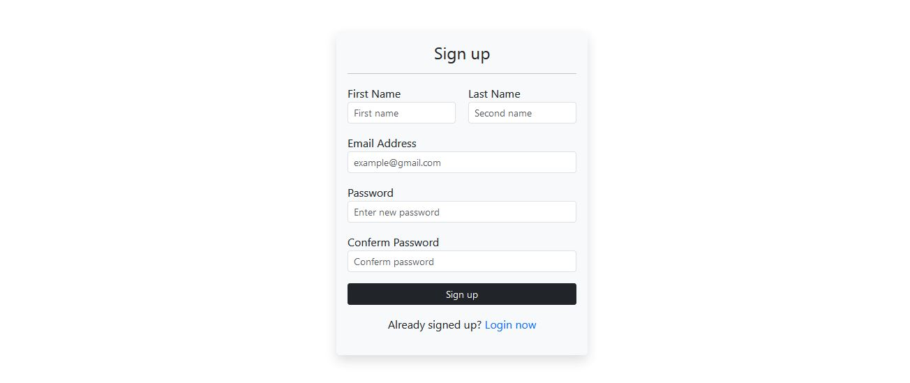
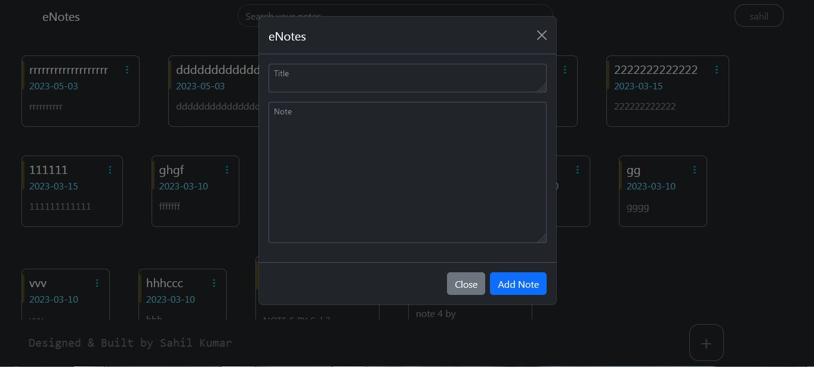
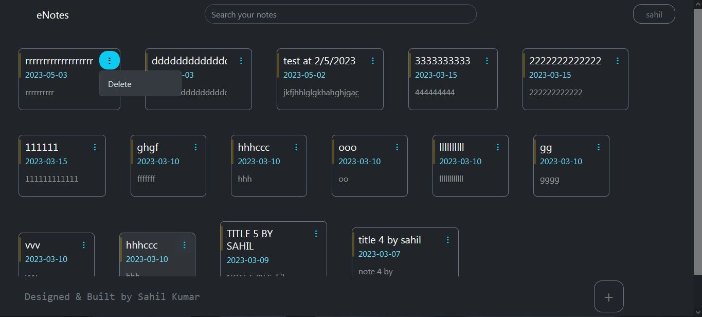
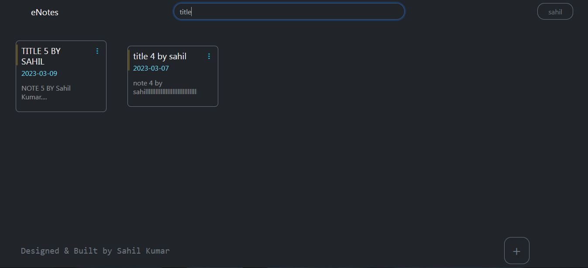

# Easy Notes

Easy Notes App is a simple web application for taking notes developed using Bootstrap, JavaScript, AJAX, PHP, and MySQL. It allows users to perform CRUD (Create, Read, Update, and Delete) operations on their notes. Multiple users can create their accounts and store their notes online. They can create, delete, update, and search for their notes. The app also includes sign-up and sign-in options to authenticate users and ensure data privacy.

## Features

- User registration and login
- Create, read, update, and delete notes
- Search notes by title or content
- User-friendly interface with responsive design
- Efficient and fast loading times
- Secured data storage using MySQL database

## Technologies

- Front-end: Bootstrap, JavaScript, AJAX
- Back-end: PHP
- Database: MySQL

## Getting Started

To run the Easy Notes App on your local machine, you will need to have the following software installed:

- Apache web server
- PHP
- MySQL

OR

- Simply use XAMPP

After installing the necessary software, follow these steps to set up the application:

1. Clone or download the Easy Notes App source code from the GitHub repository.
2. Extract the files and copy them to your Apache web server's root directory.
3. Create a MySQL database and import the `notesdb.sql` file.
4. Edit the `config.php` file in the `includes` folder and set your database connection details.
5. Start your Apache web server and navigate to `http://localhost/easy-notes` in your web browser.

## Usage

To use the Easy Notes App, follow these steps:

1. Register for a new account by clicking the "Sign up" button on the login page.

2. Log in using your email and password.

3. To create a new note, click the "+" button and enter your note's title and content.

4. To view, edit, or delete a note, click the corresponding action note card.

5. To search for a note, enter a keyword in the search bar.

## Live Demo

You can try the live demo of this project by clicking on the following link: [https//easynotes.great-site.net/](https//easynotes.great-site.net/)

## Contributions

If you would like to contribute to the Easy Notes App, please follow these guidelines:

1. Fork the repository and create a new branch for your changes.
2. Make your changes and test them locally.
3. Submit a pull request with a detailed description of your changes.
